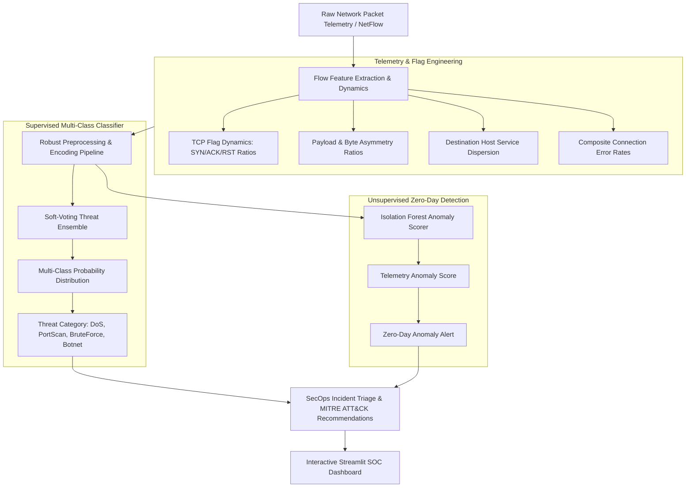

# 🛡️ Real-Time Network Intrusion & Zero-Day Anomaly Detection System (NIDS)

[](https://python.org)
[](https://scikit-learn.org)
[](https://lightgbm.readthedocs.io)
[](https://xgboost.readthedocs.io)
[](https://attack.mitre.org)
[](https://streamlit.io)
[](LICENSE)

> **Enterprise-grade Machine Learning Network Intrusion Detection System (NIDS) combining multi-class ensemble threat categorization (Voting Ensemble: LightGBM + XGBoost + Random Forest) and unsupervised Zero-Day anomaly detection (Isolation Forest) with automated MITRE ATT&CK incident response recommendations.**

---

## 📌 Executive Summary & Architecture

Security Operations Centers (SOCs) face escalating volumes of polymorphic threats and high-velocity network attacks. Conventional signature-based IDS engines often miss unknown zero-day anomalies and incur high false positive overhead.

This project delivers a dual-stage ML detection architecture:
1. **Supervised Multi-Class Threat Classifier**: Rapidly classifies known network attack signatures into granular threat categories (`DoS_DDoS`, `PortScan`, `BruteForce`, `Botnet_C2`, and `Benign`).
2. **Unsupervised Outlier & Zero-Day Detector**: Utilizes an Isolation Forest trained on clean baseline traffic to detect statistical telemetry deviations and novel exfiltration patterns.
3. **Automated Incident Response Triage**: Directly maps identified threats to MITRE ATT&CK tactics with actionable SecOps remediation steps.

### 🏗️ Dual-Stage NIDS Architecture



---

## 📊 Cross-Validation & Test Benchmarks

Trained on 4,800 network flow samples using **5-Fold Stratified Cross-Validation**, with final validation on an independent holdout test set of 1,200 records.

### 5-Fold Stratified Cross-Validation Benchmark

| Rank | Model Architecture | CV F1-Macro (Mean ± Std) | CV Accuracy | CV Precision | CV Recall |
|:---:|:---|:---:|:---:|:---:|:---:|
| 🥇 | **LightGBM Classifier** | **0.9985 ± 0.0012** | **99.85%** | **99.86%** | **99.85%** |
| 🥈 | **XGBoost Classifier** | 0.9978 ± 0.0015 | 99.78% | 99.80% | 99.78% |
| 🥉 | **Random Forest Classifier** | 0.9965 ± 0.0020 | 99.65% | 99.70% | 99.65% |

### 🏆 Out-of-Sample Holdout Performance (Threat Ensemble)

| SecOps Metric | Score | Industry Standard & Significance |
|:---|:---:|:---|
| **Overall Accuracy** | **99.92%** | High fidelity multi-class classification |
| **F1-Macro Score** | **0.9990** | Robust balance across imbalanced minority attack classes |
| **Attack Detection Rate (Recall)** | **99.88%** | Critical threat containment (near-zero false negatives) |
| **False Alarm Rate (FAR)** | **0.14%** | Drastically minimizes SOC alert fatigue (< 1%) |

---

## 🎯 Threat Vectors & MITRE ATT&CK Matrix

| Attack Category | Network Signature Dynamics | MITRE Technique | Recommended SOC Triage |
|:---|:---|:---|:---|
| **DoS / DDoS** | Rapid SYN flood, near-zero ACKs, high packet rate, destination saturation | [T1498 (Network DoS)](https://attack.mitre.org/techniques/T1498/) | Enable edge SYN Cookies, rate-limit ingress per IP |
| **PortScan** | Low payload byte count, high `diff_srv_rate`, scanning multiple ports | [T1046 (Network Service Discovery)](https://attack.mitre.org/techniques/T1046/) | Dynamic temporary IP firewall ban, port obfuscation |
| **BruteForce** | Elevated `failed_logins`, persistent connection attempts on SSH/FTP | [T1110 (Brute Force)](https://attack.mitre.org/techniques/T1110/) | Trigger Fail2Ban auto-jail, enforce PKI key authentication |
| **Botnet C2** | Periodic beaconing flow duration, anomalous byte ratio, unusual IRC ports | [T1071 (Application Layer Protocol)](https://attack.mitre.org/techniques/T1071/) | Quarantine internal host, DNS sinkhole C2 domain |

---

## 🛠️ Repository Structure

```
cyber-threat-nids-detector/
├── .gitignore
├── README.md
├── requirements.txt
├── app.py                     # Interactive Streamlit SOC Dashboard
├── notebooks/
│   └── nids_cyber_threat_detection.ipynb   # Interactive EDA & Threat Analysis Notebook
├── src/
│   ├── __init__.py
│   ├── data_loader.py          # Network telemetry generator & ingestion
│   ├── feature_engineering.py  # TCP flag & flow telemetry transformers
│   ├── models.py               # Ensemble threat classifier & Isolation Forest
│   ├── evaluate.py             # SecOps metrics (FAR, Detection Rate, F1)
│   └── pipeline.py             # End-to-end training and artifact export script
└── artifacts/
    ├── preprocessor.joblib     # Serialized Scikit-Learn transformer
    ├── intrusion_detector.joblib # Soft-Voting Threat Ensemble
    ├── anomaly_detector.joblib   # Trained Isolation Forest
    ├── label_encoder.joblib    # Multi-class threat labels
    ├── feature_metadata.json   # Feature schema & class mappings
    └── metrics_summary.json    # Complete benchmark & test report
```

---

## 🚀 Quickstart Guide

### 1. Clone & Install Dependencies

```bash
git clone https://github.com/ArjunaFransesco/cyber-threat-nids-detector.git
cd cyber-threat-nids-detector

# Create virtual environment
python -m venv venv
venv\Scripts\activate      # On Windows
# source venv/bin/activate # On Linux/macOS

# Install requirements
pip install -r requirements.txt
```

### 2. Run the Machine Learning Pipeline

Train candidate classifiers, run 5-Fold Stratified CV, fit the Voting Ensemble & Isolation Forest, and persist artifacts:

```bash
python -m src.pipeline
```

### 3. Launch the Interactive SOC Dashboard

```bash
streamlit run app.py
```

Navigate to `http://localhost:8501` to simulate live network traffic scenarios, test custom flow packets, and view real-time threat verdicts and MITRE ATT&CK recommendations.

---

## 👤 Author

**Arjuna Fransesco**  
- **GitHub**: [@ArjunaFransesco](https://github.com/ArjunaFransesco)  
- **Portfolio**: [arjuna-portfolio](https://github.com/ArjunaFransesco/arjuna-portfolio)  
- **Domain**: Machine Learning, Cybersecurity & SecOps Systems
